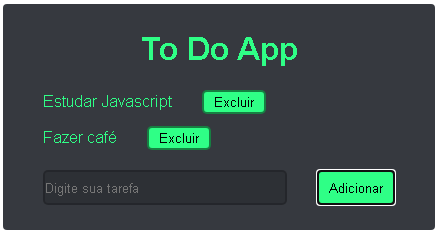
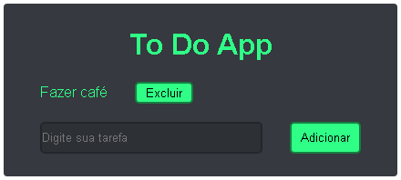

# to-Do

Aplicativo de To Do feitas utilizando javascript, html e css

<h3>Recursos</h3>
  <ul>
    <li>Permite adicionar as tarefas</li>
    <li>Permite a exclusão das terefas</li>
    <li>Os dados são persistidos no storage do navegador</li>
  </ul>
  
  <h3>Screenshot</h3>
    <h4 align="center">
      
    </h4>
    <h4 align="center">
      
    </h4>
